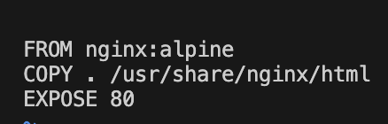
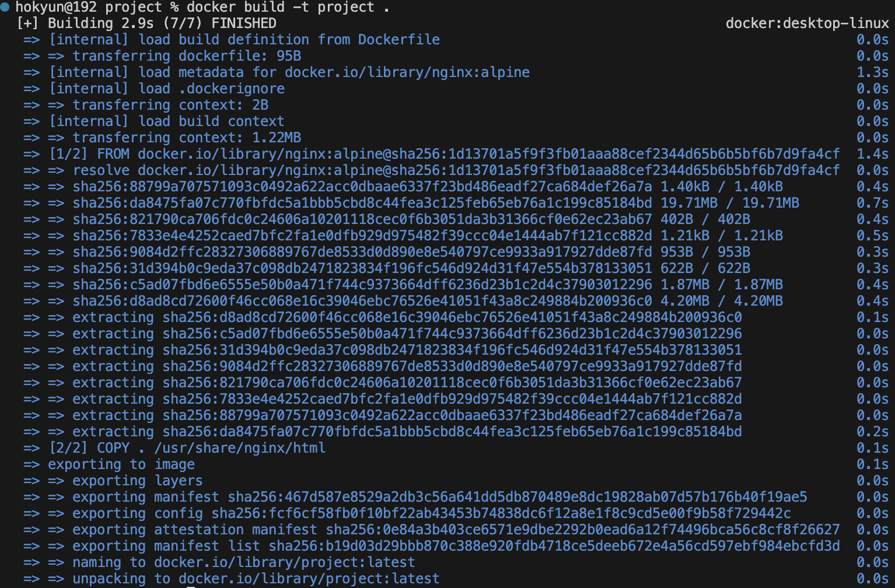
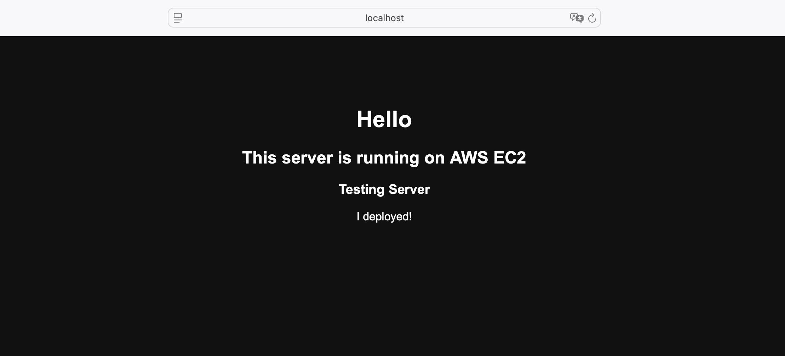
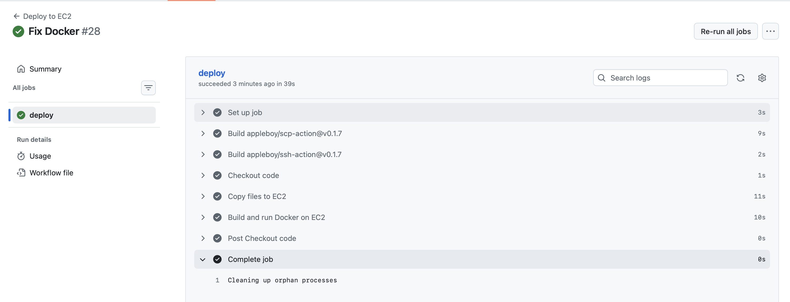
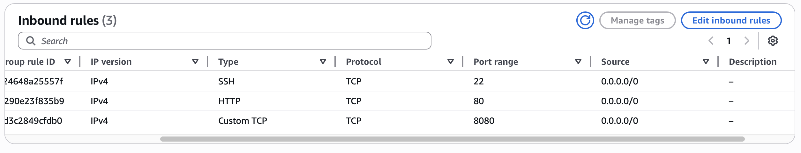
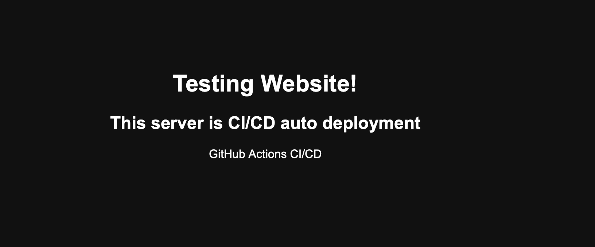
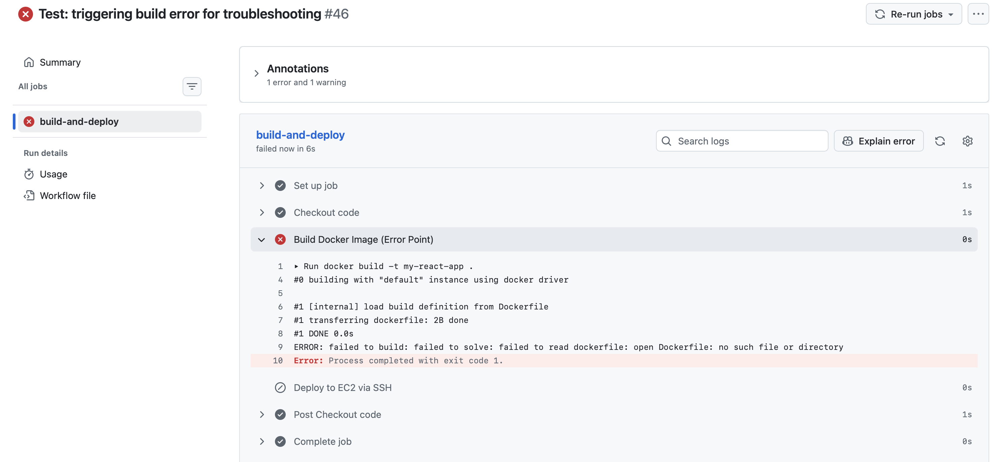
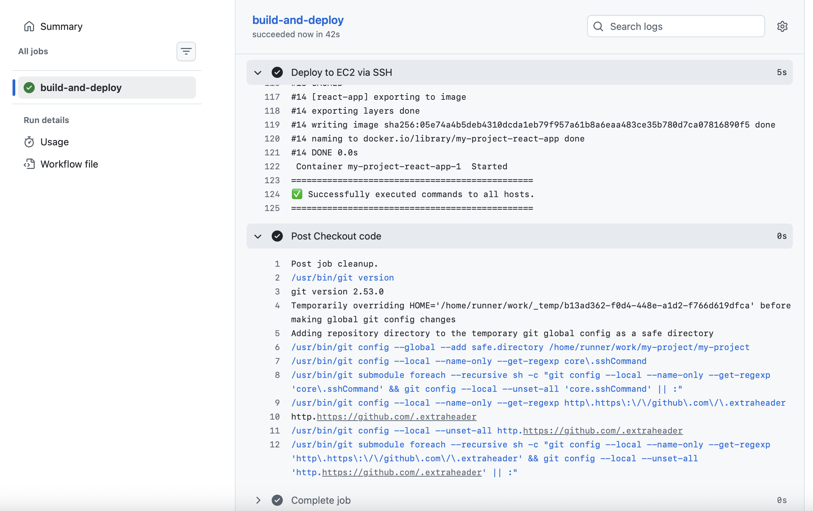
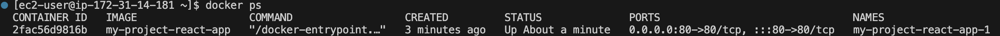
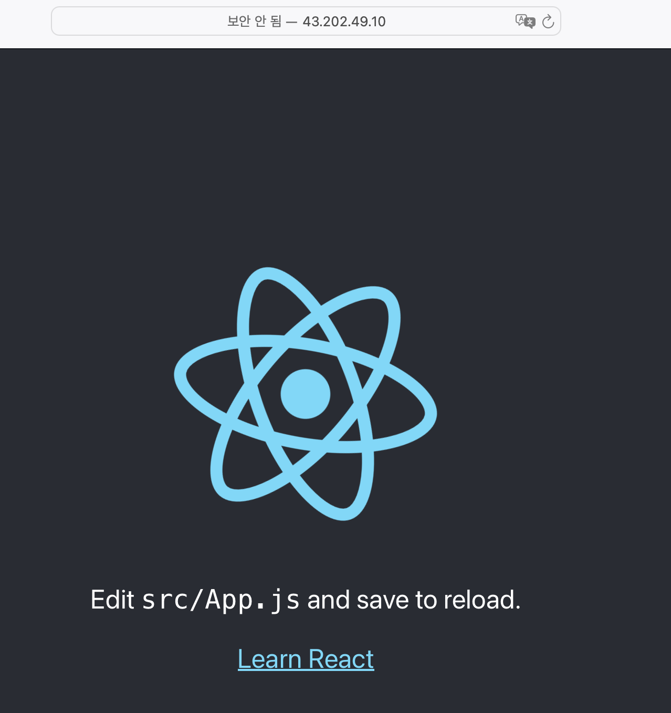

# AWS EC2 Nginx + CI/CD Docker Deployment Practice

## Project Overview
Learn how real-world engineers deploy web services using:
- Linux server
- Nginx
- GitHub
- CI/CD
- Docker
Instead of manual uploads, I practiced automated deployments step-by-step

## DAY 1 - Nginx Manual Deployment
### What I did
- Created EC2 (Amazon Linux)
- Connected with SSH
- Installed Nginx
- Uploaded index.html maually
- Checked website with Public IP

## DAY 2 - GitHub CI/CD Automation
Manual file editing on the server is inefficient
So I automated deployment using GitHub Actions

### What I did
- Installed git locally
- Created project files
- Created GitHub Actions workflow
- Added EC2 SSH key as Secret
- Automatic deployment after push

## Workflow file
.github/workflows/deploy.yml

name: Deploy to EC2

on:
  push:
    branches: [ main ]

jobs:
  deploy:
    runs-on: ubuntu-latest

    steps:
      - name: SSH to EC2 and deploy
        uses: appleboy/ssh-action@v1.0.0
        with:
          host: "${{ secrets.EC2_HOST }}"
          username: ec2-user
          key: "${{ secrets.EC2_KEY }}"
          script: |
            cd /usr/share/nginx/html
            git pull origin main
            sudo systemctl reload nginx

## Result
When I push code -> server updates automatically

## Screenshots

## DAY 3 - Docker Container Deployment
Installing nginx directly on the server:
- hard to manage
- environment dependent
- not portable
Docker solves this by running nginx inside containers

### What I did
- Installed Docker
- Fixed permission issue (docker group)
- Ran nginx container
- Built custom Docker image
- Served website through container

## Result
- nginx runs inside Docker container
- no direct installation on host
- easier deployment & portability
- Accessible via http://localhost:8080

## Screenshots

## DAY 4 - GitHub Actions CI/CD Deployment
Automatic deployment from GitHub to EC2
Ensures updates website always live

### What I did
- Created GitHub Actions workflow for automatic deployment
- Connected SSH key to EC2
- Sent project files to EC2 using scp-action
- Built and ran the Docker container on the server
- Confirmed the website is live on the EC2 IP address

## Workflow file
.github/workflows/deploy.yml

name: Deploy to EC2

on:
  push:
    branches: [ main ]

jobs:
  deploy:
    runs-on: ubuntu-latest
    steps:
      - name: Checkout code
        uses: actions/checkout@v3

      - name: Copy files to EC2
        uses: appleboy/scp-action@v0.1.7
        with:
          host: "${{ secrets.EC2_HOST }}"
          username: ec2-user
          key: "${{ secrets.EC2_KEY }}"
          source: "."
          target: "/home/ec2-user/project"

      - name: Build and run Docker on EC2
        uses: appleboy/ssh-action@v0.1.7
        with:
          host: "${{ secrets.EC2_HOST }}"
          username: ec2-user
          key: "${{ secrets.EC2_KEY }}"
          script: |
            cd /home/ec2-user/project

            # 기존 컨테이너 제거
            docker stop project || true
            docker rm project || true

            # Docker build & run
            docker build -t project .
            docker run -d -p 8080:80 --name project project

## Screenshots

## Troubleshotting
### Issue: GitHub Actions did not copy files to EC2

**Situation**
- GitHub Actions ran successfully, but files (Dockerfile, index.html) were missing on the EC2 server
- The Docker container on EC2 is running on port `8080`

**Cause**
- The workflow did not include a proper step to copy project files to EC2
- SCP/SSH action was not configured correctly

**Solution**
- Use `appleboy/scp-action` to copy all project files to EC2
- Add an **inbound rule** to the EC2 Security Group

**Result**
- Access the deployed web app via

## DAY 5 - React App Deployment with Docker & EC2
Deploying a React application to AWS EC2 using Docker and Docker Compose with a fully automated CI/CD pipeline via GitHub Actions

### What I did
- Created a Multi-stage Dockerfile to optimize image size and security
- Managed the web server and application environment consistently
- Configured GitHub Actions to build and deploy the Docker image automatically upon pushing to the main brance

**Screenshoots**

## Troubleshotting
### Issue: Docker Build Faailure in CI/CD Pipeline

**Situation**
- GitHub Actions failed during the "Build Docker Image" step

**Cause**
- The workflow was searching for the Dockerfile in the root directory, but it was located in the /my-app subdirectory

**Solution**
- Updated the context and file pathes in deploy.yml to correctly point the project folder

**Result**
- Successfully automated the build and deployment process

## What I Learned
- Linux server management
- SSH remote access
- Nginx setup
- Git workflow
- CI/CD automation with GitHub Actions
- Docker containerization
- AWS Security Group settings (Opening port 8080)
- Docker ensures the app runs the same on my local machine and the AWS server

## Next Steps (Planned)
- Docker Compose
- HTTPS
- Multi-container setup
- ECS or Kubernetes
- Full production pipeline
