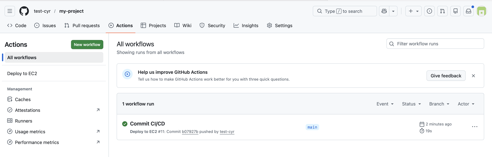
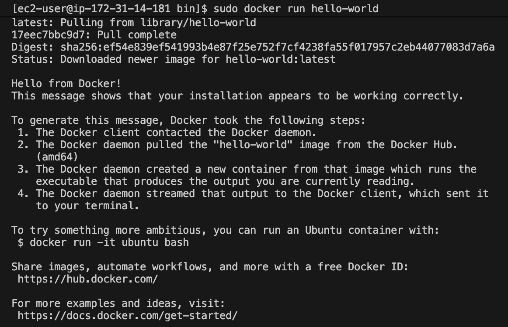
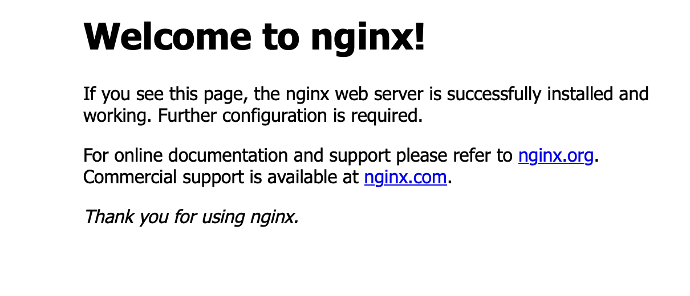

# AWS EC2 Nginx + CI/CD Docker Deployment Practice

## Project Overview
Learn how real-world engineers deploy web services using:
- Linux server
- Nginx
- GitHub
- CI/CD
- Docker
Instead of manual uploads, I practiced automated deployments step-by-step

## DAY 1 - Nginx Manual Deployment
what I did
- Created EC2 (Amazon Linux)
- Connected with SSH
- Installed Nginx
- Uploaded index.html maually
- Checked website with Public IP

## DAY 2 - GitHub CI/CD Automation
Manual file editing on the server is inefficient.
So I automated deployment using GitHub Actions.

what I did
- Installed git locally
- Created project files
- Created GitHub Actions workflow
- Added EC2 SSH key as Secret
- Automatic deployment after push

## Workflow file
.github/workflows/deploy.yml
name: Deploy to EC2

on:
  push:
    branches: [ main ]

jobs:
  deploy:
    runs-on: ubuntu-latest

    steps:
      - name: SSH to EC2 and deploy
        uses: appleboy/ssh-action@v1.0.0
        with:
          host: "${{ secrets.EC2_HOST }}"
          username: ec2-user
          key: "${{ secrets.EC2_KEY }}"
          script: |
            cd /usr/share/nginx/html
            git pull origin main
            sudo systemctl reload nginx

## Result
When I push code -> server updates automatically

## Screenshots

## DAY 3 - Docker Container Deployment
Installing nginx directly on the server:
- hard to manage
- environment dependent
- not portable
Docker solves this by running nginx inside containers.

what I did
- Installed Docker
- Fixed permission issue (docker group)
- Ran nginx container
- Built custom Docker image
- Served website through container

## Result
- nginx runs inside Docker container
- no direct installation on host
- easier deployment & portability

## Screenshots

## What I Learned
- Linux server management
- SSH remote access
- Nginx setup
- Git workflow
- CI/CD automation
- Docker containerization
- Real-world deployment process

## Next Steps (Planned)
- Docker Compose
- HTTPS
- Multi-container setup
- ECS or Kubernetes
- Full production pipeline
